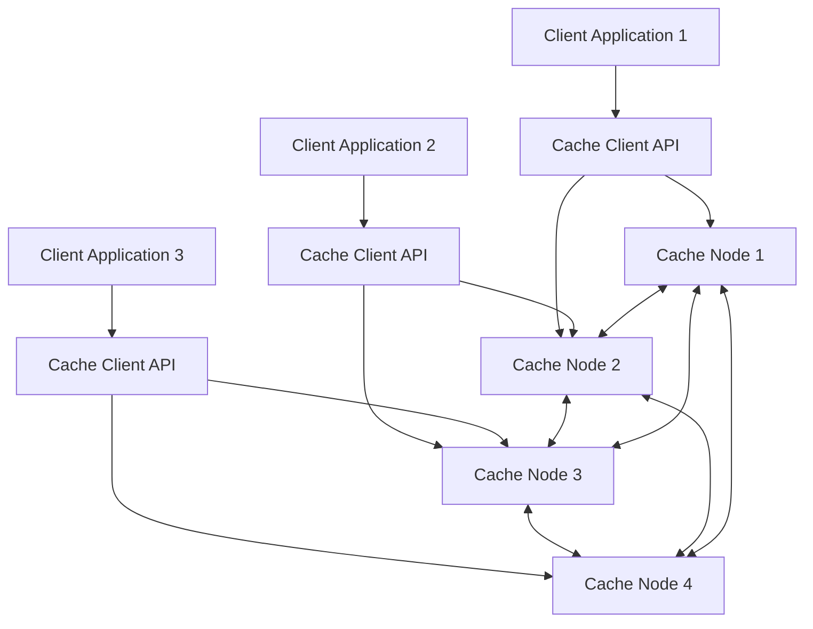
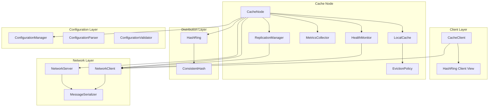

# Design Document: Distributed Cache System

## Overview

The Distributed Cache System is a fault-tolerant, high-performance distributed key-value store built in Java 17. The system distributes data across multiple cache nodes using consistent hashing with virtual nodes, maintains configurable replication for fault tolerance, and provides automatic eviction policies to manage memory efficiently.

### Key Design Principles

1. **Fault Tolerance**: Data replication and health monitoring ensure availability despite node failures
2. **Scalability**: Consistent hashing with virtual nodes enables elastic scaling without full data redistribution
3. **Performance**: Concurrent data structures and non-blocking operations optimize throughput
4. **Simplicity**: Client API abstracts distributed complexity behind familiar get/put/delete operations
5. **Observability**: Comprehensive metrics enable performance monitoring and troubleshooting

### Technology Stack

- **Language**: Java 17
- **Build Tool**: Maven 3.x
- **Testing**: JUnit 5 for unit tests, jqwik for property-based tests
- **Logging**: SLF4J with Logback
- **Serialization**: Java Serialization (with extensibility for alternatives)
- **Networking**: Java NIO for non-blocking I/O

## Architecture

### System Architecture

The system follows a peer-to-peer architecture where each cache node is equal and can serve client requests. There is no central coordinator, which eliminates single points of failure.



### Component Architecture



## Components and Interfaces

### 1. CacheClient

The client-side API that applications use to interact with the distributed cache.

```java
package com.distributedcache.client;

import java.util.List;
import java.util.Map;
import java.util.Optional;
import java.util.concurrent.CompletableFuture;

/**
 * Client API for interacting with the distributed cache system.
 * Handles routing, retries, and failover transparently.
 */
public interface CacheClient extends AutoCloseable {
    
    /**
     * Retrieves a value from the cache.
     * 
     * @param key the cache key (max 256 bytes)
     * @return Optional containing the value if found, empty otherwise
     * @throws CacheException if operation fails after retries
     */
    <V> Optional<V> get(String key) throws CacheException;
    
    /**
     * Stores a key-value pair in the cache.
     * 
     * @param key the cache key (max 256 bytes)
     * @param value the value to store (max 1 MB)
     * @throws CacheException if operation fails after retries
     */
    <V> void put(String key, V value) throws CacheException;
    
    /**
     * Removes a key from the cache.
     * 
     * @param key the cache key to remove
     * @throws CacheException if operation fails after retries
     */
    void delete(String key) throws CacheException;
    
    /**
     * Retrieves multiple values in a single batch operation.
     * 
     * @param keys the list of keys to retrieve
     * @return map of keys to values (missing keys are omitted)
     * @throws CacheException if operation fails after retries
     */
    <V> Map<String, V> batchGet(List<String> keys) throws CacheException;
    
    /**
     * Asynchronous version of get operation.
     */
    <V> CompletableFuture<Optional<V>> getAsync(String key);
    
    /**
     * Asynchronous version of put operation.
     */
    <V> CompletableFuture<Void> putAsync(String key, V value);
    
    /**
     * Asynchronous version of delete operation.
     */
    CompletableFuture<Void> deleteAsync(String key);
}
```

### 2. CacheNode

The core cache node that stores data and coordinates with other nodes.

```java
package com.distributedcache.node;

import com.distributedcache.cache.LocalCache;
import com.distributedcache.replication.ReplicationManager;
import com.distributedcache.network.NetworkServer;
import java.util.Optional;

/**
 * Represents a single node in the distributed cache cluster.
 * Handles local storage, replication, and inter-node communication.
 */
public interface CacheNode extends AutoCloseable {
    
    /**
     * Starts the cache node and joins the cluster.
     */
    void start() throws CacheException;
    
    /**
     * Stops the cache node and leaves the cluster gracefully.
     */
    void stop() throws CacheException;
    
    /**
     * Gets the unique identifier for this node.
     */
    String getNodeId();
    
    /**
     * Gets the network address of this node.
     */
    NodeAddress getAddress();
    
    /**
     * Handles a get request (local or forwarded).
     */
    <V> Optional<V> handleGet(String key);
    
    /**
     * Handles a put request (local or forwarded).
     */
    <V> void handlePut(String key, V value);
    
    /**
     * Handles a delete request (local or forwarded).
     */
    void handleDelete(String key);
    
    /**
     * Returns current node metrics.
     */
    NodeMetrics getMetrics();
    
    /**
     * Returns current node health status.
     */
    HealthStatus getHealthStatus();
}
```

### 3. HashRing

Implements consistent hashing with virtual nodes for key distribution.

```java
package com.distributedcache.hashing;

import java.util.List;
import java.util.Set;

/**
 * Consistent hash ring for distributing keys across cache nodes.
 * Uses virtual nodes to improve load distribution.
 */
public interface HashRing {
    
    /**
     * Number of virtual nodes per physical node.
     */
    int VIRTUAL_NODES_PER_NODE = 150;
    
    /**
     * Adds a node to the hash ring.
     * 
     * @param node the node to add
     */
    void addNode(NodeInfo node);
    
    /**
     * Removes a node from the hash ring.
     * 
     * @param nodeId the ID of the node to remove
     * @return set of keys that need to be redistributed
     */
    Set<String> removeNode(String nodeId);
    
    /**
     * Gets the primary node responsible for a key.
     * 
     * @param key the cache key
     * @return the primary node for this key
     */
    NodeInfo getPrimaryNode(String key);
    
    /**
     * Gets the replica nodes for a key.
     * 
     * @param key the cache key
     * @param replicationFactor number of replicas (including primary)
     * @return list of nodes in preference order (primary first)
     */
    List<NodeInfo> getReplicaNodes(String key, int replicationFactor);
    
    /**
     * Gets all nodes currently in the ring.
     */
    Set<NodeInfo> getAllNodes();
    
    /**
     * Gets the hash value for a key.
     */
    long hash(String key);
}
```

### 4. LocalCache

Thread-safe local storage with eviction policy support.

```java
package com.distributedcache.cache;

import com.distributedcache.eviction.EvictionPolicy;
import java.util.Optional;

/**
 * Thread-safe local cache storage with eviction support.
 */
public interface LocalCache<K, V> {
    
    /**
     * Stores a key-value pair.
     * Triggers eviction if capacity threshold is reached.
     */
    void put(K key, V value);
    
    /**
     * Retrieves a value by key.
     */
    Optional<V> get(K key);
    
    /**
     * Removes a key-value pair.
     */
    void remove(K key);
    
    /**
     * Returns the current number of entries.
     */
    int size();
    
    /**
     * Returns the current memory usage in bytes.
     */
    long getMemoryUsage();
    
    /**
     * Returns the configured capacity in bytes.
     */
    long getCapacity();
    
    /**
     * Returns the current memory usage as a percentage.
     */
    double getMemoryUsagePercentage();
    
    /**
     * Clears all entries.
     */
    void clear();
    
    /**
     * Sets the eviction policy.
     */
    void setEvictionPolicy(EvictionPolicy<K, V> policy);
}
```

### 5. EvictionPolicy

Strategy interface for cache eviction algorithms.

```java
package com.distributedcache.eviction;

import java.util.Set;

/**
 * Strategy interface for cache eviction policies.
 */
public interface EvictionPolicy<K, V> {
    
    /**
     * Threshold percentage that triggers eviction.
     */
    double EVICTION_THRESHOLD = 0.95;
    
    /**
     * Minimum percentage to free when eviction is triggered.
     */
    double EVICTION_TARGET = 0.10;
    
    /**
     * Called when an entry is accessed (get operation).
     */
    void onAccess(K key);
    
    /**
     * Called when an entry is added or updated.
     */
    void onPut(K key, V value);
    
    /**
     * Called when an entry is removed.
     */
    void onRemove(K key);
    
    /**
     * Selects entries to evict to free the target percentage of capacity.
     * 
     * @param targetBytes number of bytes to free
     * @return set of keys to evict
     */
    Set<K> selectVictims(long targetBytes);
    
    /**
     * Returns the eviction policy type.
     */
    EvictionPolicyType getType();
}

/**
 * Supported eviction policy types.
 */
public enum EvictionPolicyType {
    LRU,  // Least Recently Used
    LFU,  // Least Frequently Used
    FIFO  // First In First Out
}
```

### 6. ReplicationManager

Manages data replication across nodes.

```java
package com.distributedcache.replication;

import com.distributedcache.hashing.NodeInfo;
import java.util.List;
import java.util.concurrent.CompletableFuture;

/**
 * Manages replication of cache entries across nodes.
 */
public interface ReplicationManager {
    
    /**
     * Maximum replication factor supported.
     */
    int MAX_REPLICATION_FACTOR = 5;
    
    /**
     * Replication timeout in milliseconds.
     */
    long REPLICATION_TIMEOUT_MS = 100;
    
    /**
     * Replicates a put operation to replica nodes.
     * 
     * @param key the cache key
     * @param value the value to replicate
     * @param replicas the list of replica nodes (excluding primary)
     * @return future that completes when replication finishes
     */
    <V> CompletableFuture<Void> replicatePut(String key, V value, List<NodeInfo> replicas);
    
    /**
     * Replicates a delete operation to replica nodes.
     */
    CompletableFuture<Void> replicateDelete(String key, List<NodeInfo> replicas);
    
    /**
     * Synchronizes data with a new replica node.
     */
    CompletableFuture<Void> syncWithReplica(NodeInfo replica, List<String> keys);
    
    /**
     * Gets the configured replication factor.
     */
    int getReplicationFactor();
}
```

### 7. HealthMonitor

Monitors node health and availability.

```java
package com.distributedcache.node;

import java.time.Duration;
import java.util.Set;
import java.util.function.Consumer;

/**
 * Monitors health of cache nodes in the cluster.
 */
public interface HealthMonitor {
    
    /**
     * Health check interval.
     */
    Duration DEFAULT_CHECK_INTERVAL = Duration.ofSeconds(5);
    
    /**
     * Number of consecutive failures before marking unavailable.
     */
    int FAILURE_THRESHOLD = 3;
    
    /**
     * Starts health monitoring.
     */
    void start();
    
    /**
     * Stops health monitoring.
     */
    void stop();
    
    /**
     * Registers a callback for node status changes.
     */
    void onStatusChange(Consumer<NodeStatusEvent> callback);
    
    /**
     * Gets the current status of a node.
     */
    HealthStatus getNodeStatus(String nodeId);
    
    /**
     * Gets all healthy nodes.
     */
    Set<NodeInfo> getHealthyNodes();
    
    /**
     * Manually triggers a health check for a node.
     */
    void checkNode(String nodeId);
}

/**
 * Health status of a cache node.
 */
public enum HealthStatus {
    HEALTHY,
    DEGRADED,
    UNAVAILABLE
}
```

### 8. NetworkServer and NetworkClient

Handle inter-node communication.

```java
package com.distributedcache.network;

import java.util.concurrent.CompletableFuture;

/**
 * Server component for receiving inter-node messages.
 */
public interface NetworkServer extends AutoCloseable {
    
    /**
     * Starts the network server on the configured port.
     */
    void start() throws NetworkException;
    
    /**
     * Stops the network server.
     */
    void stop() throws NetworkException;
    
    /**
     * Registers a handler for incoming messages.
     */
    void registerHandler(MessageType type, MessageHandler handler);
    
    /**
     * Gets the port the server is listening on.
     */
    int getPort();
}

/**
 * Client component for sending inter-node messages.
 */
public interface NetworkClient {
    
    /**
     * Maximum retry attempts for failed transmissions.
     */
    int MAX_RETRIES = 3;
    
    /**
     * Expected message delivery time under normal conditions.
     */
    long EXPECTED_LATENCY_MS = 20;
    
    /**
     * Sends a message to a remote node.
     * 
     * @param target the target node
     * @param message the message to send
     * @return future containing the response
     */
    <T> CompletableFuture<T> send(NodeInfo target, Message message);
    
    /**
     * Sends a message with retry logic and exponential backoff.
     */
    <T> CompletableFuture<T> sendWithRetry(NodeInfo target, Message message);
    
    /**
     * Broadcasts a message to all nodes.
     */
    CompletableFuture<Void> broadcast(Message message);
}
```

### 9. MessageSerializer

Handles serialization and deserialization of messages and cache values.

```java
package com.distributedcache.utils;

/**
 * Serializes and deserializes objects for storage and transmission.
 */
public interface MessageSerializer {
    
    /**
     * Serializes an object to bytes.
     * 
     * @param obj the object to serialize
     * @return byte array representation
     * @throws SerializationException if serialization fails
     */
    byte[] serialize(Object obj) throws SerializationException;
    
    /**
     * Deserializes bytes to an object.
     * 
     * @param bytes the byte array
     * @param type the expected type
     * @return the deserialized object
     * @throws SerializationException if deserialization fails
     */
    <T> T deserialize(byte[] bytes, Class<T> type) throws SerializationException;
    
    /**
     * Estimates the size of an object in bytes.
     */
    long estimateSize(Object obj);
}
```

### 10. ConfigurationManager

Manages system configuration.

```java
package com.distributedcache.utils;

import java.nio.file.Path;
import java.time.Duration;

/**
 * Manages system configuration.
 */
public interface ConfigurationManager {
    
    /**
     * Loads configuration from a file.
     */
    CacheConfiguration load(Path configFile) throws ConfigurationException;
    
    /**
     * Saves configuration to a file.
     */
    void save(CacheConfiguration config, Path configFile) throws ConfigurationException;
    
    /**
     * Validates a configuration object.
     */
    ValidationResult validate(CacheConfiguration config);
    
    /**
     * Formats a configuration object as a human-readable string.
     */
    String prettyPrint(CacheConfiguration config);
}

/**
 * Cache configuration object.
 */
public class CacheConfiguration {
    private long cacheCapacityBytes;
    private int replicationFactor;
    private EvictionPolicyType evictionPolicy;
    private Duration healthCheckInterval;
    private int serverPort;
    private List<String> seedNodes;
    
    // Validation constraints
    public static final long MIN_CAPACITY = 1024 * 1024; // 1 MB
    public static final long MAX_CAPACITY = 100L * 1024 * 1024 * 1024; // 100 GB
    public static final Duration MIN_HEALTH_CHECK = Duration.ofSeconds(1);
    public static final Duration MAX_HEALTH_CHECK = Duration.ofSeconds(60);
    
    // Getters and setters...
}
```

### 11. MetricsCollector

Collects and exposes performance metrics.

```java
package com.distributedcache.node;

import java.util.Map;

/**
 * Collects and exposes cache performance metrics.
 */
public interface MetricsCollector {
    
    /**
     * Metrics update interval.
     */
    long UPDATE_INTERVAL_MS = 1000;
    
    /**
     * Records a cache hit.
     */
    void recordHit();
    
    /**
     * Records a cache miss.
     */
    void recordMiss();
    
    /**
     * Records a get operation latency.
     */
    void recordGetLatency(long latencyMs);
    
    /**
     * Records current memory usage.
     */
    void recordMemoryUsage(long bytes, long capacity);
    
    /**
     * Gets current metrics snapshot.
     */
    CacheMetrics getMetrics();
    
    /**
     * Resets all metrics.
     */
    void reset();
}

/**
 * Snapshot of cache metrics.
 */
public class CacheMetrics {
    private double hitsPerSecond;
    private double missesPerSecond;
    private double averageGetLatencyMs;
    private double memoryUsagePercentage;
    private long totalHits;
    private long totalMisses;
    
    // Getters...
}
```

## Data Models

### CacheEntry

```java
package com.distributedcache.cache;

import java.time.Instant;
import java.io.Serializable;

/**
 * Represents a cache entry with metadata for eviction policies.
 */
public class CacheEntry<V> implements Serializable {
    private final String key;
    private final V value;
    private final Instant createdAt;
    private volatile Instant lastAccessedAt;
    private volatile long accessCount;
    private final long sizeBytes;
    
    public CacheEntry(String key, V value, long sizeBytes) {
        this.key = key;
        this.value = value;
        this.sizeBytes = sizeBytes;
        this.createdAt = Instant.now();
        this.lastAccessedAt = createdAt;
        this.accessCount = 0;
    }
    
    public void recordAccess() {
        this.lastAccessedAt = Instant.now();
        this.accessCount++;
    }
    
    // Getters...
}
```

### NodeInfo

```java
package com.distributedcache.hashing;

import java.io.Serializable;
import java.util.Objects;

/**
 * Information about a cache node in the cluster.
 */
public class NodeInfo implements Serializable, Comparable<NodeInfo> {
    private final String nodeId;
    private final String host;
    private final int port;
    private final long joinedAt;
    
    public NodeInfo(String nodeId, String host, int port) {
        this.nodeId = nodeId;
        this.host = host;
        this.port = port;
        this.joinedAt = System.currentTimeMillis();
    }
    
    public NodeAddress getAddress() {
        return new NodeAddress(host, port);
    }
    
    @Override
    public int compareTo(NodeInfo other) {
        return this.nodeId.compareTo(other.nodeId);
    }
    
    @Override
    public boolean equals(Object o) {
        if (this == o) return true;
        if (!(o instanceof NodeInfo)) return false;
        NodeInfo nodeInfo = (NodeInfo) o;
        return nodeId.equals(nodeInfo.nodeId);
    }
    
    @Override
    public int hashCode() {
        return Objects.hash(nodeId);
    }
    
    // Getters...
}
```

### Message

```java
package com.distributedcache.network;

import java.io.Serializable;
import java.util.UUID;

/**
 * Base class for inter-node messages.
 */
public abstract class Message implements Serializable {
    private final String messageId;
    private final MessageType type;
    private final String sourceNodeId;
    private final long timestamp;
    
    protected Message(MessageType type, String sourceNodeId) {
        this.messageId = UUID.randomUUID().toString();
        this.type = type;
        this.sourceNodeId = sourceNodeId;
        this.timestamp = System.currentTimeMillis();
    }
    
    // Getters...
}

/**
 * Message types for inter-node communication.
 */
public enum MessageType {
    GET_REQUEST,
    GET_RESPONSE,
    PUT_REQUEST,
    PUT_RESPONSE,
    DELETE_REQUEST,
    DELETE_RESPONSE,
    REPLICATE_REQUEST,
    HEALTH_CHECK,
    HEALTH_RESPONSE,
    NODE_JOIN,
    NODE_LEAVE,
    REBALANCE
}
```

## Data Structures

### Consistent Hash Ring Implementation

The hash ring uses a TreeMap to maintain virtual nodes in sorted order, enabling efficient O(log n) lookups:

```java
// Conceptual structure
TreeMap<Long, NodeInfo> ring;  // hash value -> node
Map<String, Set<Long>> nodeToHashes;  // node ID -> set of hash positions

// For each physical node, create 150 virtual nodes
for (int i = 0; i < 150; i++) {
    String virtualNodeId = nodeId + "#" + i;
    long hash = hashFunction(virtualNodeId);
    ring.put(hash, nodeInfo);
}

// To find node for a key
long keyHash = hashFunction(key);
Map.Entry<Long, NodeInfo> entry = ring.ceilingEntry(keyHash);
if (entry == null) {
    entry = ring.firstEntry();  // wrap around
}
return entry.getValue();
```

### Thread-Safe Local Cache

Uses ConcurrentHashMap with read-write locks for eviction:

```java
// Conceptual structure
ConcurrentHashMap<String, CacheEntry<V>> storage;
ReadWriteLock evictionLock;
AtomicLong currentMemoryUsage;
EvictionPolicy<String, V> evictionPolicy;

// Get operation (no lock needed)
Optional<V> get(String key) {
    CacheEntry<V> entry = storage.get(key);
    if (entry != null) {
        entry.recordAccess();
        evictionPolicy.onAccess(key);
        return Optional.of(entry.getValue());
    }
    return Optional.empty();
}

// Put operation (write lock only if eviction needed)
void put(String key, V value) {
    long size = estimateSize(value);
    
    if (needsEviction()) {
        evictionLock.writeLock().lock();
        try {
            performEviction();
        } finally {
            evictionLock.writeLock().unlock();
        }
    }
    
    storage.put(key, new CacheEntry<>(key, value, size));
    currentMemoryUsage.addAndGet(size);
    evictionPolicy.onPut(key, value);
}
```

### LRU Eviction Policy

Uses a LinkedHashMap with access-order for O(1) LRU tracking:

```java
// Conceptual structure
LinkedHashMap<String, Long> accessOrder;  // key -> size in bytes
ReadWriteLock lock;

void onAccess(String key) {
    lock.writeLock().lock();
    try {
        Long size = accessOrder.remove(key);
        if (size != null) {
            accessOrder.put(key, size);  // move to end
        }
    } finally {
        lock.writeLock().unlock();
    }
}

Set<String> selectVictims(long targetBytes) {
    Set<String> victims = new LinkedHashSet<>();
    long freedBytes = 0;
    
    lock.readLock().lock();
    try {
        Iterator<Map.Entry<String, Long>> it = accessOrder.entrySet().iterator();
        while (it.hasNext() && freedBytes < targetBytes) {
            Map.Entry<String, Long> entry = it.next();
            victims.add(entry.getKey());
            freedBytes += entry.getValue();
        }
    } finally {
        lock.readLock().unlock();
    }
    
    return victims;
}
```


## Correctness Properties

*A property is a characteristic or behavior that should hold true across all valid executions of a system—essentially, a formal statement about what the system should do. Properties serve as the bridge between human-readable specifications and machine-verifiable correctness guarantees.*

### Property Reflection

After analyzing all acceptance criteria, I identified the following key properties that provide comprehensive coverage without redundancy:

**Core Cache Operations**: Properties 1-3 cover the fundamental get/put/delete operations and their round-trip behavior.

**Consistent Hashing**: Properties 4-6 cover deterministic mapping, idempotence, and minimal redistribution on topology changes.

**Replication**: Properties 7-9 cover replica consistency, failover, and update propagation.

**Eviction Policies**: Properties 10-12 cover the three eviction algorithms (LRU, LFU, FIFO) and their correctness.

**Serialization**: Property 13 covers the round-trip property for serialization (subsumes individual serialize/deserialize tests).

**Configuration**: Property 14 covers the round-trip property for configuration parsing/printing, and Property 15 covers validation.

**Concurrent Access**: Properties 16-17 cover thread safety for different keys and same key scenarios.

**Health Monitoring and Routing**: Properties 18-19 cover failure detection and routing exclusion.

**Client Routing**: Property 20 covers correct routing through the client API.

**Node Discovery**: Property 21 covers maintaining accurate cluster membership.

**Redundancies Eliminated**:
- Individual API method tests (6.1-6.3) are covered by core operation properties
- Individual serialize/deserialize tests (8.1-8.2) are covered by round-trip property
- Individual parse/print tests (9.1, 9.3) are covered by round-trip property
- Timing requirements are tested separately as examples, not properties
- Metrics collection is tested with examples, not properties

### Property 1: Cache Put-Get Round Trip

*For any* valid key-value pair where the key is at most 256 bytes and the value is at most 1 MB, storing the pair in the cache and then retrieving it by key SHALL return the original value.

**Validates: Requirements 1.1, 1.2, 1.5, 1.6**

### Property 2: Cache Get Returns Not-Found for Non-Existent Keys

*For any* key that has not been stored in the cache, retrieving that key SHALL return a not-found indicator (empty Optional).

**Validates: Requirements 1.3**

### Property 3: Cache Delete Removes Entry

*For any* key-value pair that has been stored in the cache, deleting the key and then attempting to retrieve it SHALL return a not-found indicator.

**Validates: Requirements 1.4**

### Property 4: Hash Ring Maps Each Key to Exactly One Primary Node

*For any* key and any non-empty set of cache nodes, the hash ring SHALL map the key to exactly one primary node deterministically.

**Validates: Requirements 2.1**

### Property 5: Hash Ring Mapping is Idempotent

*For any* key and hash ring configuration, applying the key-to-node mapping operation multiple times SHALL always return the same primary node.

**Validates: Requirements 2.5**

### Property 6: Node Addition Redistributes Only Affected Keys

*For any* hash ring with existing nodes and keys, when a new node is added, only keys whose hash positions fall in the range now owned by the new node SHALL be redistributed.

**Validates: Requirements 2.2**

### Property 7: Node Removal Redistributes Only That Node's Keys

*For any* hash ring with multiple nodes and keys, when a node is removed, only keys that were assigned to that node SHALL be redistributed to other nodes.

**Validates: Requirements 2.3**

### Property 8: Replication Maintains Correct Number of Copies

*For any* cache entry and replication factor R (where 1 ≤ R ≤ 5), storing the entry SHALL result in exactly R copies of the entry existing across R different nodes.

**Validates: Requirements 3.1, 3.2, 3.4**

### Property 9: Replicas Serve Data When Primary Fails

*For any* cache entry that has been replicated with replication factor R > 1, if the primary node becomes unavailable, retrieving the entry from any replica node SHALL return the original value.

**Validates: Requirements 3.3**

### Property 10: Replica Updates Are Propagated

*For any* cache entry that has been replicated, updating the entry on the primary node SHALL result in all replica nodes reflecting the updated value.

**Validates: Requirements 3.5**

### Property 11: LRU Eviction Removes Least Recently Used Entry

*For any* cache with LRU eviction policy, when eviction is triggered, the entry with the oldest last-access timestamp SHALL be among the entries evicted.

**Validates: Requirements 4.2**

### Property 12: LFU Eviction Removes Least Frequently Used Entry

*For any* cache with LFU eviction policy, when eviction is triggered, the entry with the lowest access count SHALL be among the entries evicted.

**Validates: Requirements 4.3**

### Property 13: FIFO Eviction Removes Oldest Entry

*For any* cache with FIFO eviction policy, when eviction is triggered, the entry with the oldest creation timestamp SHALL be among the entries evicted.

**Validates: Requirements 4.4**

### Property 14: Eviction Frees Sufficient Space

*For any* cache that triggers eviction at 95% capacity, the eviction process SHALL free at least 10% of the total capacity.

**Validates: Requirements 4.1, 4.5**

### Property 15: Eviction Removes From All Replicas

*For any* cache entry that has been replicated, when the entry is evicted from the primary node, it SHALL also be removed from all replica nodes.

**Validates: Requirements 4.6**

### Property 16: Serialization Round Trip Preserves Equivalence

*For any* Java object that implements Serializable, serializing the object to bytes and then deserializing back to an object SHALL produce an object equivalent to the original (equal by .equals() or structural comparison).

**Validates: Requirements 8.3**

### Property 17: Configuration Round Trip Preserves Equivalence

*For any* valid configuration object, formatting it to a configuration file string (pretty-print) and then parsing it back SHALL produce a configuration object equivalent to the original.

**Validates: Requirements 9.4**

### Property 18: Configuration Validation Enforces Bounds

*For any* configuration object, validation SHALL accept cache capacities between 1 MB and 100 GB and health check intervals between 1 and 60 seconds, and SHALL reject values outside these ranges.

**Validates: Requirements 9.6, 9.7**

### Property 19: Concurrent Writes to Different Keys Preserve All Data

*For any* set of key-value pairs with distinct keys, storing all pairs concurrently SHALL result in all pairs being retrievable with their correct values.

**Validates: Requirements 11.2**

### Property 20: Concurrent Writes to Same Key Produce Consistent State

*For any* key and set of values, when multiple concurrent writes to the same key occur, the final state SHALL contain exactly one of the written values (no data corruption).

**Validates: Requirements 11.3**

### Property 21: Concurrent Reads During Writes Return Valid Data

*For any* key being concurrently read and written, read operations SHALL return either the old value or the new value, never a corrupted or partial value.

**Validates: Requirements 11.4**

### Property 22: Failed Nodes Are Excluded From Routing

*For any* node that has been marked unavailable by the health monitor, the hash ring SHALL not assign any new keys to that node.

**Validates: Requirements 5.3**

### Property 23: Recovered Nodes Are Included in Routing

*For any* node that was previously unavailable and then responds to a health check, the hash ring SHALL include that node in key assignments again.

**Validates: Requirements 5.4**

### Property 24: Client Routes to Correct Node

*For any* key and cluster configuration, the client SHALL route requests to the same node that the hash ring identifies as the primary node for that key.

**Validates: Requirements 6.4**

### Property 25: Client Retries on Replica When Primary Unavailable

*For any* key with replication factor > 1, if the primary node is unavailable, the client SHALL retry the request on a replica node.

**Validates: Requirements 6.5**

### Property 26: Batch Get Returns Correct Values for All Keys

*For any* set of keys that have been stored in the cache, a batch get operation SHALL return the correct value for each key.

**Validates: Requirements 6.6**

### Property 27: Network Retry Logic Attempts Up To 3 Retries

*For any* network message that fails to send, the network client SHALL attempt to resend the message up to 3 times before giving up.

**Validates: Requirements 7.3**

### Property 28: Node Discovery Maintains Accurate Cluster Membership

*For any* sequence of node join and leave events, each node's view of the cluster membership SHALL accurately reflect all currently active nodes.

**Validates: Requirements 10.2, 10.3**

### Property 29: Node List Persistence Survives Restarts

*For any* node with a known set of cluster members, persisting the member list and then restarting the node SHALL restore the same set of cluster members.

**Validates: Requirements 10.5**

### Property 30: Health Monitor Marks Nodes Unavailable After Consecutive Failures

*For any* node that fails to respond to 3 consecutive health checks, the health monitor SHALL mark that node as unavailable.

**Validates: Requirements 5.2**

## Error Handling

### Error Categories

The system defines clear error categories with specific handling strategies:

1. **Client Errors** (4xx-style)
   - Invalid key size (> 256 bytes)
   - Invalid value size (> 1 MB)
   - Invalid configuration parameters
   - **Handling**: Immediate rejection with descriptive error message, no retry

2. **Network Errors** (5xx-style)
   - Connection timeout
   - Connection refused
   - Message serialization failure
   - **Handling**: Retry up to 3 times with exponential backoff (100ms, 200ms, 400ms)

3. **Node Errors**
   - Node unavailable
   - Node overloaded
   - Replication timeout
   - **Handling**: Failover to replica nodes, mark node as degraded

4. **System Errors**
   - Out of memory
   - Disk full (for persistence)
   - Serialization failure
   - **Handling**: Log error, trigger eviction if memory-related, propagate to client

### Exception Hierarchy

```java
// Base exception
public class CacheException extends Exception {
    private final ErrorCode errorCode;
    private final boolean retryable;
}

// Client errors (not retryable)
public class InvalidKeyException extends CacheException { }
public class InvalidValueException extends CacheException { }
public class ConfigurationException extends CacheException { }

// Network errors (retryable)
public class NetworkException extends CacheException { }
public class TimeoutException extends NetworkException { }
public class SerializationException extends CacheException { }

// Node errors (retryable with failover)
public class NodeUnavailableException extends CacheException { }
public class ReplicationException extends CacheException { }
```

### Error Recovery Strategies

**Network Partition Handling**:
- Detect partition through health check failures
- Continue serving requests from available nodes
- Use replica nodes for data availability
- Reconcile data when partition heals (last-write-wins)

**Node Failure Recovery**:
- Health monitor detects failure (3 consecutive missed checks)
- Remove node from hash ring
- Redistribute keys to next nodes in ring
- Replicas automatically become primary for their keys

**Replication Failure Handling**:
- Primary write succeeds even if replication fails
- Log replication failures for monitoring
- Retry replication in background
- Mark replicas as out-of-sync if repeated failures

**Eviction Failure Handling**:
- If eviction cannot free enough space, reject new writes
- Log eviction failures for investigation
- Expose metrics for eviction success rate

## Testing Strategy

### Overview

The testing strategy employs a dual approach combining property-based testing for universal correctness guarantees with example-based testing for specific scenarios, edge cases, and integration points.

### Property-Based Testing

**Framework**: jqwik (https://jqwik.net/) - a mature property-based testing library for Java that integrates with JUnit 5.

**Configuration**:
- Minimum 100 iterations per property test (configured via `@Property(tries = 100)`)
- Each property test references its design document property via comment
- Tag format: `// Feature: distributed-cache-system, Property {number}: {property_text}`

**Generator Strategy**:

```java
// Example generators for property tests
@Provide
Arbitrary<String> cacheKeys() {
    return Arbitraries.strings()
        .ascii()
        .ofMinLength(1)
        .ofMaxLength(256);  // Requirement 1.5
}

@Provide
Arbitrary<byte[]> cacheValues() {
    return Arbitraries.bytes()
        .array(byte[].class)
        .ofMinSize(0)
        .ofMaxSize(1024 * 1024);  // Requirement 1.6 (1 MB)
}

@Provide
Arbitrary<CacheConfiguration> validConfigurations() {
    return Combinators.combine(
        Arbitraries.longs().between(1024 * 1024, 100L * 1024 * 1024 * 1024),  // 1 MB to 100 GB
        Arbitraries.integers().between(1, 5),  // replication factor
        Arbitraries.of(EvictionPolicyType.values()),
        Arbitraries.integers().between(1, 60)  // health check interval in seconds
    ).as(CacheConfiguration::new);
}

@Provide
Arbitrary<NodeInfo> cacheNodes() {
    return Combinators.combine(
        Arbitraries.strings().alpha().ofLength(8),  // node ID
        Arbitraries.strings().ipAddress(),
        Arbitraries.integers().between(1024, 65535)  // port
    ).as(NodeInfo::new);
}
```

**Property Test Examples**:

```java
// Property 1: Cache Put-Get Round Trip
@Property(tries = 100)
// Feature: distributed-cache-system, Property 1: For any valid key-value pair, storing and retrieving returns original value
void putGetRoundTrip(@ForAll("cacheKeys") String key, @ForAll("cacheValues") byte[] value) {
    LocalCache<String, byte[]> cache = new LocalCacheImpl<>(1024 * 1024 * 10);
    
    cache.put(key, value);
    Optional<byte[]> retrieved = cache.get(key);
    
    assertThat(retrieved).isPresent();
    assertThat(retrieved.get()).isEqualTo(value);
}

// Property 5: Hash Ring Mapping is Idempotent
@Property(tries = 100)
// Feature: distributed-cache-system, Property 5: Applying key-to-node mapping multiple times returns same node
void hashRingMappingIsIdempotent(
    @ForAll("cacheKeys") String key,
    @ForAll @Size(min = 1, max = 10) List<@From("cacheNodes") NodeInfo> nodes
) {
    HashRing ring = new ConsistentHashRing();
    nodes.forEach(ring::addNode);
    
    NodeInfo firstMapping = ring.getPrimaryNode(key);
    NodeInfo secondMapping = ring.getPrimaryNode(key);
    NodeInfo thirdMapping = ring.getPrimaryNode(key);
    
    assertThat(firstMapping).isEqualTo(secondMapping);
    assertThat(secondMapping).isEqualTo(thirdMapping);
}

// Property 16: Serialization Round Trip
@Property(tries = 100)
// Feature: distributed-cache-system, Property 16: Serializing then deserializing produces equivalent object
void serializationRoundTrip(@ForAll("serializableObjects") Serializable obj) {
    MessageSerializer serializer = new JavaMessageSerializer();
    
    byte[] serialized = serializer.serialize(obj);
    Object deserialized = serializer.deserialize(serialized, obj.getClass());
    
    assertThat(deserialized).isEqualTo(obj);
}
```

### Unit Testing

**Purpose**: Test specific examples, edge cases, error conditions, and component integration.

**Coverage Areas**:

1. **API Contract Tests**
   - Verify CacheClient methods exist and have correct signatures
   - Test with representative examples (small keys, large keys, various value types)

2. **Edge Case Tests**
   - Exactly 256-byte keys (boundary)
   - Exactly 1 MB values (boundary)
   - Empty values
   - Null handling
   - Maximum concurrent connections (1000)

3. **Error Condition Tests**
   - Keys exceeding 256 bytes
   - Values exceeding 1 MB
   - Invalid configuration values (capacity < 1 MB, capacity > 100 GB)
   - Serialization of non-serializable objects
   - Network timeouts

4. **Performance Tests**
   - Get operation latency (< 10ms requirement)
   - Replication latency (< 100ms requirement)
   - Network message delivery (< 20ms requirement)
   - Client retry latency (< 50ms requirement)

5. **Integration Tests**
   - Multi-node cluster setup
   - Node join/leave scenarios
   - Replication across nodes
   - Failover scenarios
   - Health monitoring integration

6. **Metrics Tests**
   - Hit/miss counting accuracy
   - Latency calculation correctness
   - Memory usage percentage calculation
   - Metrics update frequency

**Example Unit Tests**:

```java
@Test
void getOperationReturnsWithinLatencyRequirement() {
    LocalCache<String, String> cache = new LocalCacheImpl<>(1024 * 1024);
    cache.put("key", "value");
    
    long startTime = System.nanoTime();
    Optional<String> result = cache.get("key");
    long endTime = System.nanoTime();
    
    long latencyMs = (endTime - startTime) / 1_000_000;
    assertThat(latencyMs).isLessThan(10);  // Requirement 1.2
    assertThat(result).contains("value");
}

@Test
void keyExceeding256BytesIsRejected() {
    LocalCache<String, String> cache = new LocalCacheImpl<>(1024 * 1024);
    String oversizedKey = "a".repeat(257);
    
    assertThatThrownBy(() -> cache.put(oversizedKey, "value"))
        .isInstanceOf(InvalidKeyException.class)
        .hasMessageContaining("Key size exceeds maximum of 256 bytes");
}

@Test
void healthMonitorMarksNodeUnavailableAfterThreeFailures() {
    HealthMonitor monitor = new HealthMonitorImpl();
    NodeInfo node = new NodeInfo("node1", "localhost", 8080);
    
    // Simulate 3 consecutive failures
    monitor.recordHealthCheckFailure(node);
    assertThat(monitor.getNodeStatus(node.getNodeId())).isEqualTo(HealthStatus.HEALTHY);
    
    monitor.recordHealthCheckFailure(node);
    assertThat(monitor.getNodeStatus(node.getNodeId())).isEqualTo(HealthStatus.HEALTHY);
    
    monitor.recordHealthCheckFailure(node);
    assertThat(monitor.getNodeStatus(node.getNodeId())).isEqualTo(HealthStatus.UNAVAILABLE);
}
```

### Integration Testing

**Multi-Node Cluster Tests**:
- Start 3-5 node cluster
- Verify node discovery
- Test data distribution across nodes
- Verify replication
- Test node failure and recovery

**End-to-End Scenarios**:
- Client performs operations across cluster
- Node fails during operation
- Client automatically fails over to replica
- Node recovers and rejoins cluster
- Data rebalancing occurs

### Test Organization

```
src/test/java/com/distributedcache/
├── cache/
│   ├── LocalCachePropertyTest.java          # Property tests for local cache
│   ├── LocalCacheTest.java                  # Unit tests for local cache
│   └── EvictionPolicyTest.java              # Unit tests for eviction policies
├── hashing/
│   ├── HashRingPropertyTest.java            # Property tests for consistent hashing
│   └── HashRingTest.java                    # Unit tests for hash ring
├── replication/
│   ├── ReplicationPropertyTest.java         # Property tests for replication
│   └── ReplicationTest.java                 # Unit tests for replication
├── network/
│   ├── NetworkProtocolPropertyTest.java     # Property tests for network layer
│   └── NetworkProtocolTest.java             # Unit tests for network layer
├── utils/
│   ├── SerializationPropertyTest.java       # Property tests for serialization
│   ├── SerializationTest.java               # Unit tests for serialization
│   └── ConfigurationPropertyTest.java       # Property tests for configuration
├── integration/
│   ├── MultiNodeClusterTest.java            # Integration tests
│   └── FailoverTest.java                    # Failover scenario tests
└── generators/
    └── CacheArbitraries.java                # Shared jqwik generators
```

### Test Execution

**Maven Configuration**:

```xml
<dependency>
    <groupId>net.jqwik</groupId>
    <artifactId>jqwik</artifactId>
    <version>1.8.0</version>
    <scope>test</scope>
</dependency>
```

**Running Tests**:
```bash
# Run all tests
mvn test

# Run only property tests
mvn test -Dtest="**/*PropertyTest"

# Run only unit tests
mvn test -Dtest="**/*Test" -Dtest="!**/*PropertyTest,!**/*IntegrationTest"

# Run only integration tests
mvn test -Dtest="**/*IntegrationTest"
```

### Coverage Goals

- **Line Coverage**: Minimum 80%
- **Branch Coverage**: Minimum 75%
- **Property Test Coverage**: All 30 correctness properties implemented
- **Critical Path Coverage**: 100% (cache operations, replication, failover)

---

**End of Design Document**
